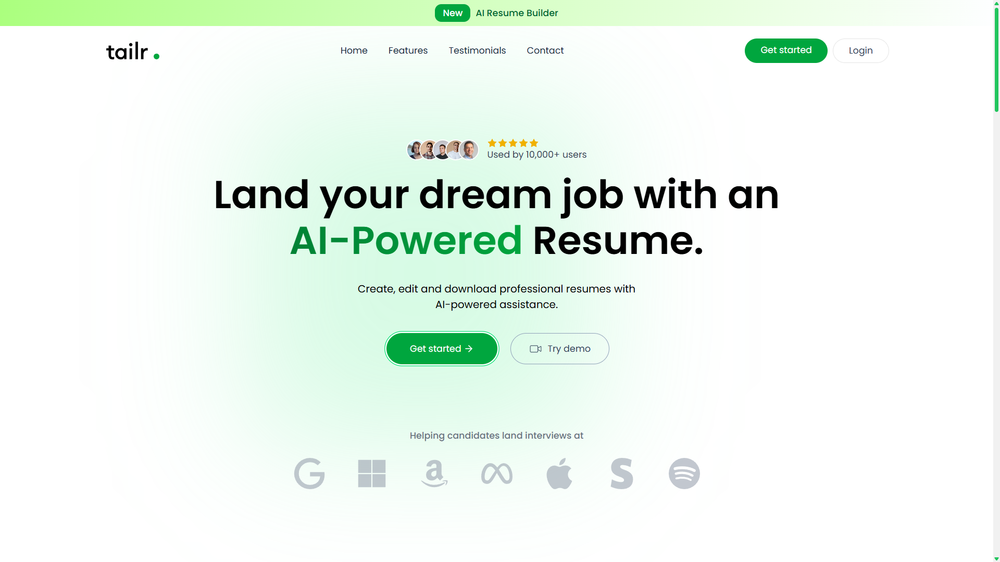
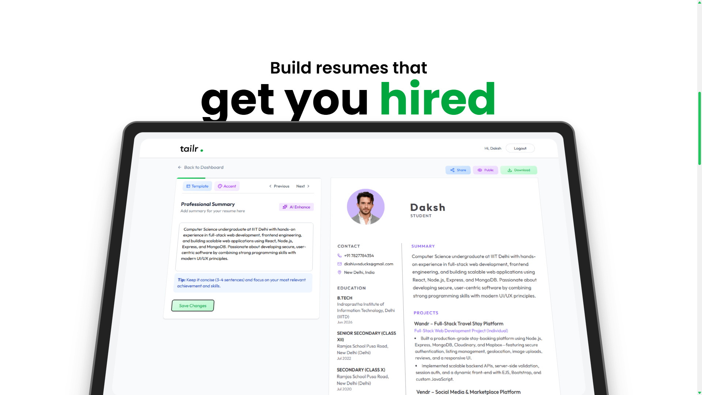
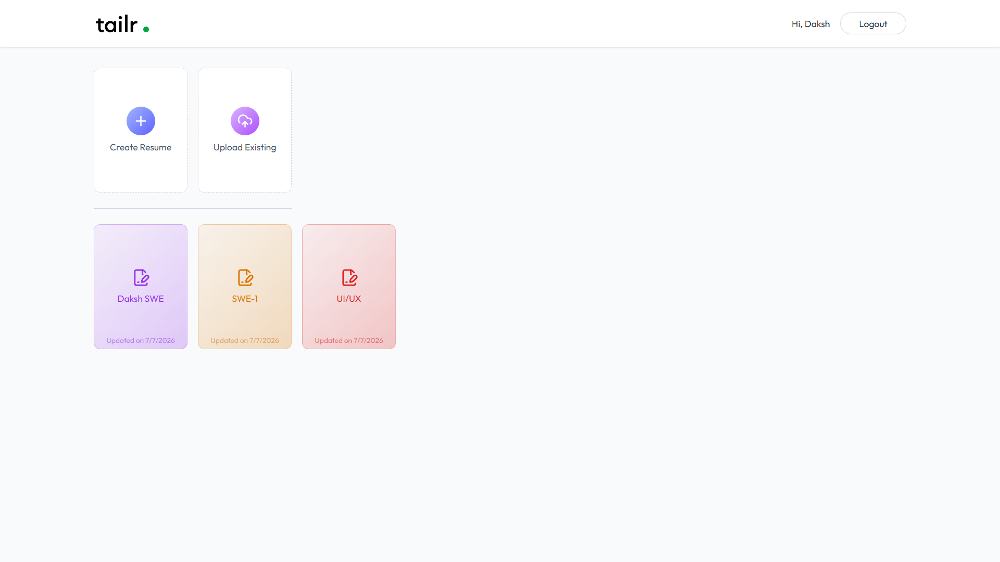
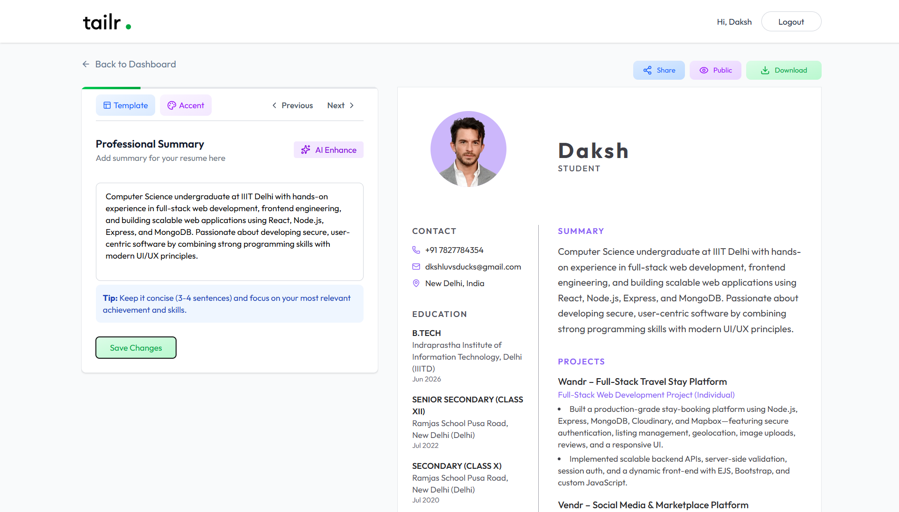

# Tailr — AI Resume Builder

<p align="center">
  
</p>

<p align="center">
  Build beautiful, ATS-friendly resumes in minutes with AI-powered writing assistance.
</p>

<p align="center">
  <a href="https://tailr-resume-builder.vercel.app"><strong>🌐 Live Demo</strong></a> •
  <a href="https://github.com/DkshLuvsDucks/tailr-resume-builder"><strong>📂 Repository</strong></a>
</p>

<p align="center">
  
  
  
  
  
  
</p>

---

## 📖 Overview

Tailr is a modern full-stack AI resume builder designed to help users create professional, ATS-friendly resumes with minimal effort.

Whether you're creating a resume from scratch or uploading an existing PDF, Tailr uses AI to extract, organize, and improve your content. Users can customize templates, generate stronger summaries and bullet points, upload profile photos, share resumes publicly, and export polished resumes as PDFs.

---

## ✨ Features

### 🤖 AI-Powered Resume Builder

* Upload an existing PDF resume and automatically convert it into an editable resume
* AI-powered resume parsing into a structured format
* Rewrite professional summaries into concise, ATS-friendly content
* Improve work experience and project descriptions with stronger action-oriented bullet points

### 📝 Resume Editor

* Section-by-section editing experience
* Personal information
* Professional summary
* Skills
* Work experience
* Projects
* Education

### 🎨 Customization

* Multiple professionally designed templates

  * Classic
  * Modern
  * Minimal
  * Minimal with Photo
* Custom accent colors
* Profile photo upload
* Automatic image cropping
* Optional AI background removal

### 👤 User Features

* Secure authentication with JWT
* Personal dashboard
* Manage multiple resumes
* Public resume sharing
* Download resumes as PDF

---

## 🖼 Preview

### Landing Page





### Dashboard



### Resume Builder




---

## 🛠 Tech Stack

### Frontend

* React 19
* Vite
* React Router v7
* Redux Toolkit
* Tailwind CSS v4
* shadcn/ui
* Framer Motion
* Axios
* React Hot Toast
* React Icons
* react-pdftotext

### Backend

* Node.js
* Express 5
* MongoDB
* Mongoose
* JWT Authentication
* bcrypt
* Multer
* OpenAI API
* ImageKit

### Deployment

* Frontend → Vercel
* Backend → Render

---

## 📁 Project Structure

```text
tailr-resume-builder/
│
├── client/
│   ├── src/
│   │   ├── app/
│   │   ├── components/
│   │   │   ├── home/
│   │   │   ├── templates/
│   │   │   └── ui/
│   │   ├── configs/
│   │   ├── pages/
│   │   └── App.jsx
│   └── ...
│
└── server/
    ├── configs/
    ├── controllers/
    ├── middlewares/
    ├── models/
    ├── routes/
    ├── utils/
    └── server.js
```

---

## 🚀 Getting Started

### Prerequisites

* Node.js 18+
* MongoDB
* OpenAI API Key
* ImageKit Account

---

### Clone the Repository

```bash
git clone https://github.com/DkshLuvsDucks/tailr-resume-builder.git

cd tailr-resume-builder
```

---

## ⚙ Backend Setup

```bash
cd server

npm install
```

Create a `.env` file inside the `server` directory.

```env
PORT=3000

MONGODB_URI=your_mongodb_connection_string

JWT_SECRET=your_jwt_secret

OPENAI_API_KEY=your_openai_api_key
OPENAI_BASE_URL=https://api.openai.com/v1
OPENAI_MODEL=gpt-4o-mini

IMAGEKIT_PRIVATE_KEY=your_imagekit_private_key
```

Start the server:

```bash
npm run server
```

or

```bash
npm start
```

---

## 💻 Frontend Setup

```bash
cd client

npm install
```

Create a `.env` file.

```env
VITE_BASE_URL=http://localhost:3000
```

Run the development server.

```bash
npm run dev
```

The frontend will run on:

```
http://localhost:5173
```

---

## 📡 API Overview

### Authentication

| Method | Endpoint              | Description         |
| ------ | --------------------- | ------------------- |
| POST   | `/api/users/register` | Register a new user |
| POST   | `/api/users/login`    | Login               |
| GET    | `/api/users/data`     | Current user        |
| GET    | `/api/users/resumes`  | Get all resumes     |

---

### Resume

| Method | Endpoint                        | Description   |
| ------ | ------------------------------- | ------------- |
| POST   | `/api/resumes/create`           | Create resume |
| PUT    | `/api/resumes/update`           | Update resume |
| DELETE | `/api/resumes/delete/:resumeId` | Delete resume |
| GET    | `/api/resumes/get/:resumeId`    | Get resume    |
| GET    | `/api/resumes/public/:resumeId` | Public resume |

---

### AI

| Method | Endpoint                    | Description                |
| ------ | --------------------------- | -------------------------- |
| POST   | `/api/ai/upload-resume`     | Parse uploaded resume      |
| POST   | `/api/ai/enhanced-pro-sum`  | Improve summary            |
| POST   | `/api/ai/enhanced-job-desc` | Improve experience bullets |

---

## 📜 Available Scripts

### Client

| Command           | Description              |
| ----------------- | ------------------------ |
| `npm run dev`     | Start development server |
| `npm run build`   | Production build         |
| `npm run preview` | Preview production build |
| `npm run lint`    | Run ESLint               |

### Server

| Command          | Description             |
| ---------------- | ----------------------- |
| `npm run server` | Start with Nodemon      |
| `npm start`      | Start production server |

---

## 🔒 Environment Variables

### Server

```env
PORT=
MONGODB_URI=
JWT_SECRET=

OPENAI_API_KEY=
OPENAI_BASE_URL=
OPENAI_MODEL=

IMAGEKIT_PRIVATE_KEY=
```

### Client

```env
VITE_BASE_URL=
```

---

## 🎯 Future Improvements

* ATS score analysis
* Drag-and-drop section reordering
* Additional resume templates
* Multi-language support
* Dark mode
* Custom fonts and typography
* Resume analytics

---

## 📄 License

This project currently does not specify a license.

If you intend to reuse or modify the code, please contact the repository owner.
